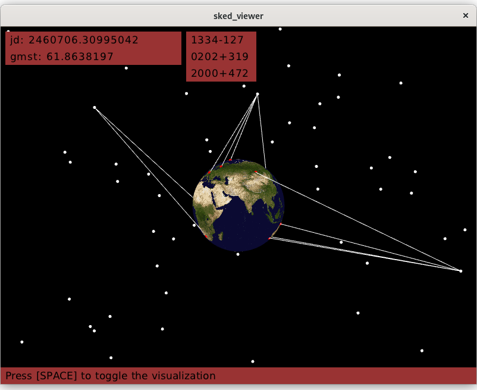

Step through VLBI schedule files (`+.skd+`) generated by https://space-geodesy.nasa.gov/techniques/tools/sked/sked.html[SKED] or https://github.com/TUW-VieVS/VieSchedpp[VieSched++].

== Usage
[source,sh]
----
#!/bin/bash

cd ./sked_viewer

# build the project and requisite libs
make && make clean

# run with an example schedule
./vis ./examples/r41192.skd

# (development only) check memory leaks
# picks a random schedule from /examples
make leak_check
----

== Dependencies
This project was developed on Linux, specifically Debian GNU/Linux 12 (bookworm). 
Most dependencies are packaged and built alongside the project.
Apart from the C standard, the only external library required is https://glew.sourceforge.net/[GLEW].

Development Environment:: `+sudo apt-get install libglew-dev+`
Runtime:: `+sudo apt-get install libglew2.2+`

== Attributions
The source of the following projects has been included in an unmodified state in accordance with their licenses.

http://iausofa.org/current_C.html[`+SOFA+`] (Issue 2023-10-11):: Distributed by the IAU. Used for GMST correction and Julian date conversion.
https://github.com/ColleagueRiley/RGFW[`+RGFW+`], https://github.com/ColleagueRiley/RFont[`+RFont+`]:: Provided the window context and font rendering respectively. Many thanks to ColleagueRiley for these headers.

The following assets are used in this project.

* https://visibleearth.nasa.gov/images/57752/blue-marble-land-surface-shallow-water-and-shaded-topography[NASA Blue Marble]
* https://dejavu-fonts.github.io/[DejaVu Sans]

== TODO
* Mouse picking to identify sources/stations.
* Support for satellite sources.
* Windows
* Internalize GLEW dependency (if license permits).