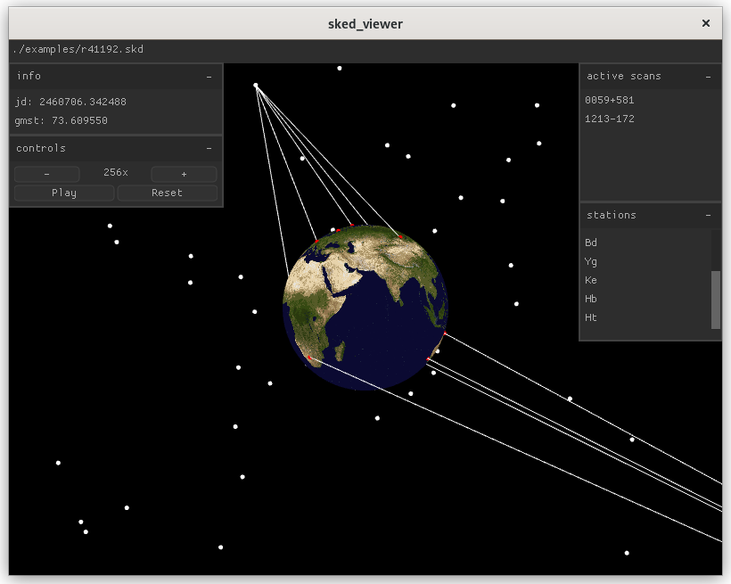

Step through VLBI schedule files (`+.skd+`) generated by https://space-geodesy.nasa.gov/techniques/tools/sked/sked.html[SKED] or https://github.com/TUW-VieVS/VieSchedpp[VieSched++].

[figure,align="center"]

== Usage
[source,sh]
----
#!/bin/bash

git clone https://github.com/hankotanks/sked_viewer.git
cd ./sked_viewer

# build project and internal dependencies
make && make clean

# run with an example schedule
./vis ./examples/r41192.skd
----

== Dependencies
This project was developed on Linux, specifically Debian GNU/Linux 12 (bookworm). 
All dependencies are packaged and built alongside the project!

== Attributions
The source of the following projects has been included in an unmodified state in accordance with their licenses.

http://iausofa.org/current_C.html[`+SOFA+`] (Issue 2023-10-11):: Distributed by the IAU. Used for GMST correction and Julian date conversion.
https://github.com/ColleagueRiley/RGFW[`+RGFW+`], https://github.com/Immediate-Mode-UI/Nuklear[`+Nuklear+`]:: These two headers are packaged together as part of https://github.com/hankotanks/glenv.h[`glenv.h`]. Many thanks to ColleagueRiley and Micha Mettke respectively.

The following assets are used in this project.

* https://visibleearth.nasa.gov/images/57752/blue-marble-land-surface-shallow-water-and-shaded-topography[NASA Blue Marble]

== TODO
* Mouse picking to identify sources/stations.
* Support for satellite sources.
* Windows
* +++<del>+++Internalize GLEW dependency (if license permits).+++</del>+++